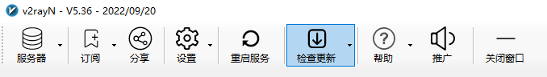

# 合租服务器

## 声明

本服务器是本人用于linux学习，网页部署练习使用，同时承担本人科研所需google scholar、wiki、youtube等流量转发需求。  

本人只允许使用该服务器进行正常需求下的浏览，禁止任何形式的危害国家安全及违法行为。

## windows请看这里

**请不要使用sstap或卸载sstap，由于过久没有维护，sstap安全性存疑**

**v2rayN请保持更新，更新方法见下**

windows系统请下载以下组件

[v2rayN](https://github.com/2dust/v2rayN)

这里提醒一下，此界面右侧有Releases，会有一个版本作为Latest发布的，图中示例是4.20（截止2022/10/27，此处为5.36），直接点进去，里面带Core最大的那个就是你需要下的那个，下载后解压直接用，无需安装。

**v2rayN更新方法**

若已经安装，则直接在检查更新中将v2rayN，v2fly-Core，Xray core，Geo files更新到最新即可。  
检查更新里面的所有选项都可以点，如果你闲着没事都升了也随便，这四个是必须要更新的而已

### windows配置过程

打开v2rayN->服务器->扫描二维码  
扫描我发给你的二维码即可得到配置  
**请私聊我要二维码，二维码会在一段时间内更新，我会把最近更新的日期放在墨墨子那里**

测试方法：选中，Ctrl+O，如果最后有毫秒作为结果，代理就成功了，如果TimeOut请联系我。

**开始连接**
右键你的右下角V2rayN蓝标->系统代理->自动配置系统代理  
蓝V变红即代表成功  
使用完毕同样位置，清除系统代理  
红V变回蓝色代表关闭代理  
  
不用记得关，随手好习惯。

## 安卓手机请看这里

**同上，请将版本升级至最新，直接下载apk覆盖安装**

下载v2rayNG

[v2rayNG](https://github.com/2dust/v2rayNG)

下载流程跟之前一样，然后给安卓手机装上，配置过程仅需扫描一个二维码，不做赘述，点开就能连。  

## Q&A

暂无