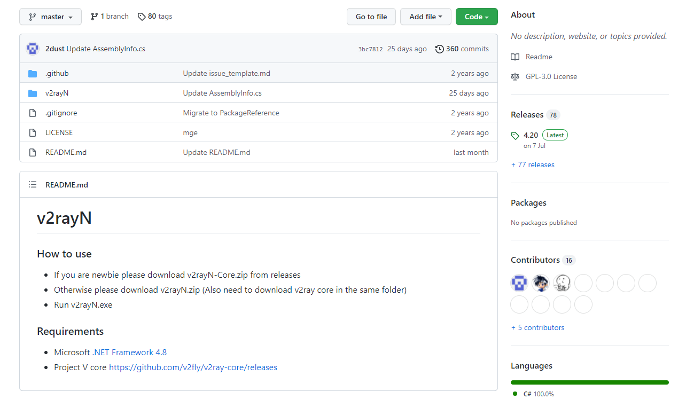
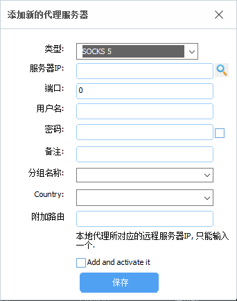
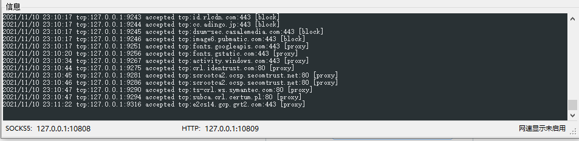
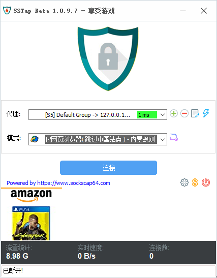

# v2ray流程@私人合租

## windows请看这里

windows系统请下载以下组件

1. sstap 1.0.9.7

   [sstap1.0.9.7](https://github.com/solikethis/SSTap-backup/raw/master/SSTap-beta-setup-1.0.9.7.exe.7z)

2. v2rayN

   [v2rayN](https://github.com/2dust/v2rayN)

   这里提醒一下，此界面右侧有Releases，会有一个版本作为Latest发布的，图中示例是4.20，直接点进去，里面带Core最大的那个就是你需要下的那个，下载后解压直接用，无需安装。

   

### windows配置过程

打开v2rayN->服务器->添加VMess服务器，只有前四项需要找我要，后面均不需要动，确定，正常情况就没问题了。

测试方法：选中，Ctrl+O，如果有毫秒作为结果，代理就成功了，如果TimeOut请联系我。

启动sstap，添加socks5代理

这里只需要填服务器IP和端口，这两项数据在刚刚配置好的v2rayN的左下角

就是127.0.0.1和10808（默认是这样的，当然你可以自定义）

最后选择仅网页浏览，连接即可

## 安卓手机请看这里

下载v2rayNG

[v2rayNG](https://github.com/2dust/v2rayNG)

下载流程跟之前一样，然后给安卓手机装上，配置过程四个值跟电脑一样，不做赘述，点开就能连。

## Q&A

一般情况下，不支持手机电脑同时连接，如有同时连接需要，请联系我。

