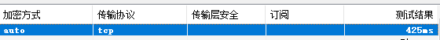

# 合租服务器

## 声明

本服务器是本人用于linux学习，网页部署练习使用，同时承担本人科研所需google scholar、wiki、youtube等流量转发需求。  

本人只允许使用该服务器进行正常需求下的浏览，禁止任何形式的危害国家安全及违法行为。

## windows请看这里

### 1. 软件下载

**请不要使用sstap或卸载sstap，由于过久没有维护，sstap安全性存疑**

**v2rayN请保持更新，更新方法见下**

windows系统请下载以下组件

[v2rayN：https://github.com/2dust/v2rayN](https://github.com/2dust/v2rayN)

这里提醒一下，此界面右侧有Releases，会有一个版本作为Latest发布的，图中示例是4.20，点击进入  
**注意，想要正常使用，v2rayN版本至少为5或6而不是图中的4**  

进入后点开Assets，仅下载-Core结尾的，尺寸最大的那个文件  
（下载一个即可，可能有时作者为了照顾不同的压缩软件分别打包成了zip和7z）  

**v2rayN更新方法**

若已经安装，则直接在检查更新中将v2rayN，v2fly-Core，Xray core，Geo files更新到最新即可。  
检查更新里面的所有选项都可以点，如果你闲着没事都升了也随便，这四个是必须要更新的而已

### 2. windows配置过程
到现在为止，软件已经下载完成，仅需一步配置即可

#### a.获取并扫描二维码
打开v2rayN->服务器->扫描屏幕上的二维码  
扫描我发给你的二维码，它会提示导入成功  
**请私聊我要二维码**

#### b.更新订阅

然后在订阅中更新订阅（不通过代理）即可得到配置  

**在得到节点后，双击打开配置详情，建议将core类型设置为Xray**

测试方法：选中，Ctrl+O，如果最后有毫秒作为结果，代理就成功了，如果TimeOut请联系我。

#### c.开始连接
右键你的右下角V2rayN蓝标->系统代理->自动配置系统代理  
蓝V变红即代表成功  
使用完毕同样位置，清除系统代理  
红V变回蓝色代表关闭代理  
  
不用记得关，随手好习惯。

## 安卓手机请看这里

**同上，请将版本升级至最新，直接下载apk覆盖安装**

下载v2rayNG

[v2rayNG：https://github.com/2dust/v2rayNG](https://github.com/2dust/v2rayNG)

下载流程跟之前一样，然后给安卓手机装上，配置过程同上，仅需扫描同一个二维码，然后更新订阅，不做赘述，点亮小飞机就能连。  

## Q&A

如果连接不上，可能是节点失效，请返回上面**更新订阅**章节重复进行操作，如果更新完的结点数据有更新，那证明已经换过，应该可连；如果节点没有更新且无法连接，恭喜你是第一个发现问题的，请私聊我。